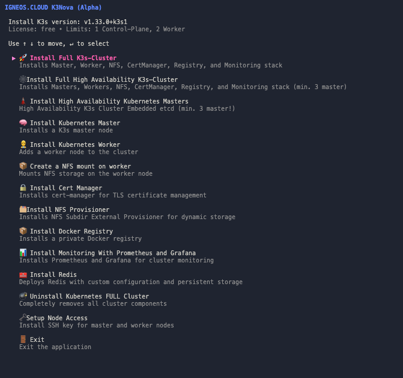

# K3Nova K3s Cluster Installer

> Current Version: **0.0.1** (beta) • Build Date: **06.09.2025**

K3Nova is a **modular**, **interactive** CLI tool written in **Go** that automates the installation, configuration, and management of lightweight Kubernetes clusters using **K3s**. Its goal is to significantly reduce the manual overhead of setting up distributed Kubernetes environments while ensuring consistency, repeatability, and operational simplicity.



## License & Editions

K3Nova is **proprietary software** and uses a license-based model with three editions:

| Edition        | Max Control Planes | Max Workers | Features                               | Expiration |
| -------------- | ------------------ | ----------- | -------------------------------------- | ---------- |
| **Free**       | 1                  | 2           | traefik_adv, monitoring, nfs, registry | Never      |
| **Pro**        | 3                  | 10          | All features                           | 1 Year     |
| **Enterprise** | ∞                  | ∞           | All features                           | 3 Years    |

### License Activation

By default, K3Nova runs in **Free Mode**.

To unlock **Pro** or **Enterprise** features:

1. Purchase a license from **Igneos.Cloud**.
2. You will receive a signed license file:  
   `k3nova-license.jwt`
3. Place the file in:

```bash
./license/k3nova-license.jwt
```

4. On the next start, K3Nova will automatically unlock the correct edition.

> 💡 If no valid license file is found or the signature is invalid,  
> K3Nova automatically falls back to the **Free Edition**.

For full license terms, see [LICENSE_PROPRIETARY.md](LICENSE_PROPRIETARY.md).

## Key Features

- 🛡️ **Install High Availability K3s Cluster**
- ✅ Install K3s Control Planes
- 👷 Install K3s Workers
- 📦 Deploy NFS mounts and Persistent Volumes
- 🔐 Install cert-manager with Let’s Encrypt
- 📊 Install Monitoring with Prometheus and Grafana
- 🚀 Set up the entire cluster with all components in one step
- 🗃️ Install Redis with persistent storage and authentication
- 🐳 Create and configure a private Docker Registry

## Usage

### Step 1: Download the Binary

Choose the binary matching your OS and architecture. These binaries are updated automatically whenever changes are merged into `main`:

| OS      | Architecture | Binary                     |
| ------- | ------------ | -------------------------- |
| Linux   | amd64        | `k3nova-linux-amd64`       |
| macOS   | amd64        | `k3nova-darwin-amd64`      |
| Windows | amd64        | `k3nova-windows-amd64.exe` |

> ⚠️ **Note:** Advanced features (e.g., HA clusters, monitoring, registry integration)  
> require a valid **Pro** or **Enterprise** license file.

### Step 2: Prepare Configuration

Make sure your `config/k3nova-config.json` file exists in the project root or specify the path explicitly.

```bash
k3nova-linux-amd64 validate
```

### 🚀 Step 3: Run the Installer

**On Linux:**

```bash
chmod +x k3nova-linux-amd64
./k3nova-linux-amd64
```

**On macOS:**

```bash
chmod +x k3nova-darwin-arm64
sudo xattr -r -d com.apple.quarantine ./k3nova-darwin-arm64
./k3nova-darwin-arm64
```

> 💡 **Note for macOS users:** macOS uses **Gatekeeper** to block binaries from unknown developers.  
> The `xattr` command removes the quarantine flag so you can run the installer without restrictions.

**On Windows (PowerShell):**

```powershell
k3nova-windows-amd64.exe
```

## Configuration Overview

K3Nova uses a single declarative **`config/k3nova-config.json`** file to define:

- Control Plane and Worker topology
- Docker Registry settings
- NFS storage
- TLS/Cert-manager configuration
- Grafana/Prometheus monitoring
- Redis and additional services

For advanced examples, check the [documentation](https://igneos.blog/k3nova/).

## Documentation & Support

- 📚 **Docs & Tutorials:** [K3Nova Docs](https://igneos.blog/k3nova/)
- 💬 **Discussions:** [GitHub Discussions](https://github.com/AndrejSchefer/K3Nova/discussions)

## Contributing

K3Nova is currently in active development. Feedback, ideas, and feature requests are welcome!

For discussions and roadmap, visit: [GitHub Discussions](https://github.com/AndrejSchefer/K3Nova/discussions)

## License

This project is proprietary software.  
See [LICENSE_PROPRIETARY.md](LICENSE_PROPRIETARY.md) for full license terms.
