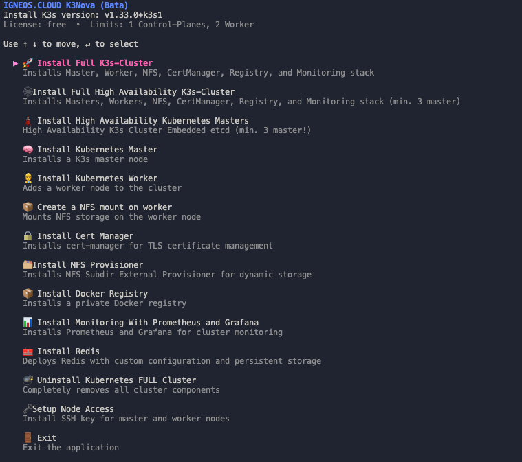

# K3Nova — K3s Cluster Installer

> **Current Version:** `0.1.1` • **Build Date:** `25.09.2025`

K3Nova is a **modular**, **interactive** CLI tool written in **Go** that automates the installation, configuration, and management of lightweight Kubernetes clusters using **K3s**.  
Its goal is to drastically reduce the complexity of setting up distributed Kubernetes environments while ensuring **consistency**, **repeatability**, and **operational simplicity**.

> **Note**: K3Nova is currently in active development.
> While the core features are functional, you may still encounter some bugs or unfinished features.
> Feedback, ideas, and contributions are highly appreciated!
> Join the discussion here: [K3Nova Discussions](https://github.com/AndrejSchefer/K3Nova/discussions)



This tool enables users to provision a complete K3s cluster consisting of a **single Control Planes node** and multiple worker nodes, or to deploy a full **High Availability (HA) control plane** across three or more Control Planes nodes. It establishes SSH connections to the target hosts (either physical servers or virtual machines), where it executes installation routines, applies configurations, and starts necessary services. Authentication is handled via user/password or SSH key pairs, as defined in a declarative JSON-based configuration file.

> For the installation you need at least three (two would also work) virtual machines or physical servers with Ubuntu Server and root (or passwordless sudo) rights.

The core functionality covers the entire cluster lifecycle:

- **Control Planes node initialization**
  Installs K3s on the designated Control Planes host, configures secure networking interfaces, and generates the join token for worker registration.

- **Worker node integration**
  Installs K3s on each worker, configures them using the master’s join token, and seamlessly adds them to the cluster.

- **High Availability (HA) control plane**

  - **Embedded etcd quorum** across three or more Control Planes nodes
  - One Control Planes is flagged `cluster_init:true` to bootstrap the control plane (`--cluster-init`), while all other masters join via `K3S_URL=https://<bootstrap-ip>:6443 K3S_TOKEN=<token>`
  - Each Control Planes is issued a TLS certificate valid for both its IP address and your chosen DNS name, ensuring secure communication even without external DNS
  - Automates certificate-authority distribution and kubeconfig retrieval only from the bootstrap node

- **Cluster-wide customization**
  Includes support for mounting NFS volumes, setting up private Docker registries, deploying Ingress resources, and automating TLS certificate issuance via cert-manager.

All operations are orchestrated based on a single declarative **`config/k3nova-config.json`** file, which defines the full topology and behavior of the cluster, including IP addresses, SSH access credentials, cluster metadata (e.g., domain names, ACME email), and optional services such as Docker Registry, NFS Provisioner, Redis, Grafana, and more.

```json
{
  "control_planes": [
    {
      "ip": "",
      "ssh_user": "",
      "ssh_pass": "",
      "cluster_init": true                        # For High Availability
    }
  ],
  "workers": [
    {
      "ip": "",
      "ssh_user": "",
      "ssh_pass": ""
    }
  ],
  "docker_registry":{
    "url": "",                                    # If local use registry.local:5000
    "cluster_issuer": "letsencrypt-http01",       # letsencrypt-http01-stage
    "pvc_storage_capacity":"10Gi",
    "pass": "123456",
    "user": "registry",
    "local": true
  },
  "redis": {
    "url": "redis.local",
    "cluster_issuer": "letsencrypt-http01",       # letsencrypt-http01-stage
    "pvc_storage_capacity": "10Gi",
    "pass": "123456",
    "user": "registry",
    "image": "redis:8.0.2",
    "local": true
  },
  "grafana": {
    "grafana_url": "grafana.local",
    "cluster_issuer": "letsencrypt-http01",       # letsencrypt-http01-stage
    "grafana_url_nip_io": "grafana.192.168.179.13.nip.io",
    "pass": "123456",
    "user": "admin",
    "local": true
  },
  "k3s_token_file": "control-planes-node-token",
  "nfs": {
    "nfs_server": "",
    "nfs_user": "",
    "nfs_pass": "",
    "server": "10.0.0.10",
    "export-grafana": "/mnt/k3s-nfs-grafana",
    "export-docker-registry": "/mnt/k3s-nfs-docker_registry",
    "nfs_root_path": "/mnt/k3s-nfs-localstorage",
    "capacity": "100Gi"
  },
  "backup": {
    "schedule": "*/40 * * * *",
    "k3s_image": "alpine:3.18",
    "pvc_name": "etcd-backup-pvc",
    "storage_class_name": "nfs-client",
    "storage_size": "20Gi",
    "create_pvc": true
  },
  "email": "",
  "domain": "",
  "cluster_issuer_name": "letsencrypt-prod",
  "k3s_version": "v1.33.0+k3s1",
  "claims": {                                    # License data. not need on free version
    "email": "",
    "firstName": "",
    "lastName": "",
    "address": {
      "street": "",
      "city": "",
      "zip": "",
      "country": ""
    }
  }
}
```

Thanks to this configuration-driven approach, the K3Nova is suitable for **developers, DevOps engineers, and platform teams** who require a fast, repeatable way to stand up Kubernetes clusters—whether for local development, internal testing, or hybrid infrastructure scenarios.

## Why I built K3Nova

I created K3Nova because I want to:

- Make it easier for developers to enter the Cloud-Native and Kubernetes world
- Help people get a better understanding and feeling for Kubernetes through simple and structured setup flows
- Enable software engineers to quickly spin up full Kubernetes clusters locally with minimal configuration overhead
- Let developers focus on building software, not on struggling with complex cluster setups

## Key Features

| Feature                                     | Description                                                                           |
| ------------------------------------------- | ------------------------------------------------------------------------------------- |
| 🛡️ **High Availability K3s Cluster**        | Automated deployment of HA-ready K3s clusters                                         |
| ✅ **Control Planes**                       | Set up control plane nodes in seconds                                                 |
| 👷 **Worker Nodes**                         | Add worker nodes interactively or via config                                          |
| 📦 **NFS & Persistent Volumes**             | Automated NFS mounts and dynamic PVC provisioning                                     |
| 🔐 **Cert-Manager + Let’s Encrypt**         | Automatic TLS certificates for your Ingress routes                                    |
| 📊 **Monitoring with Prometheus & Grafana** | Full observability stack included                                                     |
| 🚀 **One-Step Cluster Setup**               | Deploy a complete cluster in a single command                                         |
| 🗄️ **Redis with Persistence**               | Install Redis with persistent storage and authentication                              |
| 🐳 **Private Docker Registry**              | Easily create and configure your internal Docker registry                             |
| 🌐 **Advanced Traefik Features**            | Full support for Traefik CRDs, IngressRoutes, IngressRouteTCP, and custom EntryPoints |

## Usage

### **Step 1 — Download the Binary**

Pick the binary matching your OS and architecture.  
Binaries are automatically updated whenever changes are merged into `main`.

Download last release https://github.com/AndrejSchefer/K3Nova/releases

| OS      | Architecture | Binary                     |
| ------- | ------------ | -------------------------- |
| Linux   | amd64        | `k3nova-linux-amd64`       |
| macOS   | amd64        | `k3nova-darwin-amd64`      |
| Windows | amd64        | `k3nova-windows-amd64.exe` |

> ⚠️ **Note:** Advanced features (e.g., HA clusters)  
> require a valid **Pro** or **Enterprise** license.

### **Step 2 — Validate Configuration**

Ensure that your `config/k3nova-config.json` exists or specify a custom path:

```bash
k3nova-linux-amd64 validate
```

### **Step 3 — Run the Installer**

**Linux:**

```bash
chmod +x k3nova-linux-amd64
./k3nova-linux-amd64
```

**macOS:**

```bash
chmod +x k3nova-darwin-arm64
sudo xattr -r -d com.apple.quarantine ./k3nova-darwin-arm64
./k3nova-darwin-arm64
```

> 💡 **Note for macOS users:** macOS **Gatekeeper** may block binaries.  
> Use the `xattr` command to remove the quarantine flag.

**Windows (PowerShell):**

```powershell
k3nova-windows-amd64.exe
```

## Advanced Traefik Features

K3Nova provides **built-in support** for advanced Traefik configurations:

- ✅ Automatic installation of **Traefik CRDs**
- 🌍 **IngressRoute** & **IngressRouteTCP** support
- 🔄 Custom **EntryPoints** for HTTP(S), Redis, PostgreSQL, and more
- 🔐 Full **Let's Encrypt** TLS automation

> These features are enabled by default in **Pro** and **Enterprise** editions.

## High Availability Mode (HA)

The **High Availability** mode leverages K3s’s embedded etcd to build a resilient control plane across **three or more master nodes**. In this configuration, one node bootstraps the cluster (`--cluster-init`), and the remaining masters join it to form an HA etcd quorum. Workers can then connect to the HA cluster just as they would in a single-master setup.

### Prerequisites

- **At least three** Linux hosts (VMs or physical machines) running a supported Ubuntu Server release
- Network connectivity: all masters and workers must reach each other on ports **6443** (K3s API) and **2379–2380** (etcd)

### Example `config/k3nova-config.json`

Place this file alongside your installer binary (or pass a custom path via a flag). The `"cluster_init"` flag must be set to `true` on **exactly one** master—the bootstrap node.

```jsonc
{
  "masters": [
    {
      "ip": "192.168.179.10",
      "ssh_user": "kubernetes",
      "ssh_pass": "password123",
      "cluster_init": true // Only this first master will bootstrap etcd
    },
    {
      "ip": "192.168.179.11",
      "ssh_user": "kubernetes",
      "ssh_pass": "password123",
      "cluster_init": false
    },
    {
      "ip": "192.168.179.12",
      "ssh_user": "kubernetes",
      "ssh_pass": "password123",
      "cluster_init": false
    }
  ],
  "workers": [
    {
      "ip": "192.168.179.20",
      "ssh_user": "kubernetes",
      "ssh_pass": "password123"
    }
  ],
  "domain": "igneos.cloud",
  "k3s_version": "v1.33.0+k3s1",
  "cluster_token": "K10S-CLUSTER-TOKEN-1234567890",
  "k3s_token_file": "master-node-token"
  // …other sections (docker_registry, nfs, grafana, etc.) remain the same
}
```

## License & Editions

K3Nova is **proprietary software** and uses a license-based model with three editions:

| Edition        | Max Control Planes | Max Workers | Features                                                           | Expiration |
| -------------- | ------------------ | ----------- | ------------------------------------------------------------------ | ---------- |
| **Free**       | 1                  | 2           | Monitoring, Registry, Redis, Advanced Traefik and NFS Provisionber | Never      |
| **Pro**        | 3                  | 10          | All advanced features                                              | 1 Year     |
| **Enterprise** | ∞                  | ∞           | Full feature set                                                   | 1 Year     |

### License Activation

1. Request a Pro/Enterprise license via email: **andrej[@]schefer.dev**
2. You will receive a signed license file: `k3nova-license.jwt`
3. Place it in the following folder:

```bash
./license/k3nova-license.jwt
```

4. On the next start, K3Nova will unlock the correct edition automatically.

> 💡 If no valid license is found, K3Nova defaults to the **Free Edition**.

For full license terms, see [LICENSE_PROPRIETARY.md](LICENSE_PROPRIETARY.md).

## Third-Party Components

K3Nova uses the following third-party open source software:

- **Headlamp** – A Kubernetes Web UI  
  Licensed under the [Apache License 2.0](https://www.apache.org/licenses/LICENSE-2.0).  
  Copyright (c) 2020-2025 The Headlamp Authors.

Changes have been made to the original manifests for integration with K3Nova.

## Documentation & Support

- 📚 **Docs & Tutorials:** [K3Nova Docs](https://igneos.blog/k3nova/)
- 💬 **Discussions:** [GitHub Discussions](https://github.com/AndrejSchefer/K3Nova/discussions)
