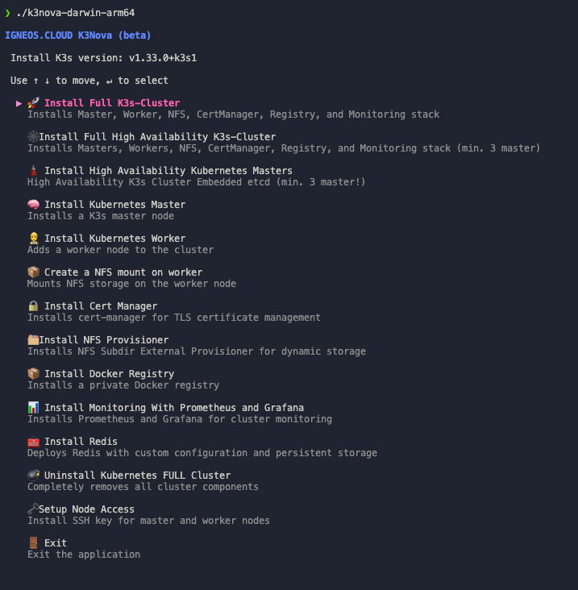

# K3Nova K3s Cluster Installer (beta)

The project is written in Go (Golang) and provides a modular, interactive CLI tool designed to automate the installation, configuration, and management of lightweight Kubernetes clusters using K3s. Its main objective is to significantly reduce the manual overhead of setting up a distributed Kubernetes environment while ensuring consistency, repeatability, and operational simplicity.



This tool enables users to provision a complete K3s cluster consisting of a **single Control Planes node** and multiple worker nodes, or to deploy a full **High Availability (HA) control plane** across three or more Control Planes nodes. It establishes SSH connections to the target hosts (either physical servers or virtual machines), where it executes installation routines, applies configurations, and starts necessary services. Authentication is handled via user/password or SSH key pairs, as defined in a declarative JSON-based configuration file.

> For the installation you need at least three (two would also work) virtual machines or physical servers with Ubuntu Server and root (or passwordless sudo) rights.

The core functionality covers the entire cluster lifecycle:

- **Control Planes node initialization**
  Installs K3s on the designated Control Planes host, configures secure networking interfaces, and generates the join token for worker registration.

- **Worker node integration**
  Installs K3s on each worker, configures them using the master’s join token, and seamlessly adds them to the cluster.

- **High Availability (HA) control plane**

  - **Embedded etcd quorum** across three or more Control Planes nodes
  - One Control Planes is flagged `cluster_init:true` to bootstrap the control plane (`--cluster-init`), while all other masters join via `K3S_URL=https://<bootstrap-ip>:6443 K3S_TOKEN=<token>`
  - Each Control Planes is issued a TLS certificate valid for both its IP address and your chosen DNS name, ensuring secure communication even without external DNS
  - Automates certificate-authority distribution and kubeconfig retrieval only from the bootstrap node

- **Cluster-wide customization**
  Includes support for mounting NFS volumes, setting up private Docker registries, deploying Ingress resources, and automating TLS certificate issuance via cert-manager.

All operations are orchestrated based on a single declarative **`config/k3nova-config.json`** file, which defines the full topology and behavior of the cluster, including IP addresses, SSH access credentials, cluster metadata (e.g., domain names, ACME email), and optional services such as Docker Registry, NFS Provisioner, Redis, Grafana, and more.

```json
{
  "control_planes": [
    {
      "ip": "",
      "ssh_user": "",
      "ssh_pass": "",
      "cluster_init": true # For High Availability
    }
  ],
  "workers": [
    {
      "ip": "",
      "ssh_user": "",
      "ssh_pass": ""
    }
  ],
  "docker_registry":{
    "url": "",                     # if local use registry.local:80
    "pvc_storage_capacity":"10Gi",
    "pass": "123456",
    "user": "registry",
    "local": true
  },
  "redis": {
    "url": "redis.local",
    "pvc_storage_capacity": "10Gi",
    "pass": "123456",
    "user": "registry",
    "image": "redis:8.0.2",
    "local": true
  },
  "grafana": {
    "grafana_url": "grafana.k3s.localdomain",
    "grafana_url_nip_io": "grafana.192.168.179.13.nip.io",
    "pass": "123456",
    "user": "admin",
    "local": true
  },
  "k3s_token_file": "control-planes-node-token",
  "nfs": {
    "nfs_server": "",
    "nfs_user": "",
    "nfs_pass": "",
    "server": "10.0.0.10",
    "export-grafana": "/mnt/k3s-nfs-grafana",
    "export-docker-registry": "/mnt/k3s-nfs-docker_registry",
    "nfs_root_path": "/mnt/k3s-nfs-localstorage",
    "capacity": "100Gi"
  },
  "email": "",
  "domain": "",
  "cluster_issuer_name": "letsencrypt-prod",
  "k3s_version": "v1.33.0+k3s1",
  "cluster_token": "K10S-CLUSTER-TOKEN-1234567890"
}
```

Thanks to this configuration-driven approach, the K3Nova is suitable for **developers, DevOps engineers, and platform teams** who require a fast, repeatable way to stand up Kubernetes clusters—whether for local development, internal testing, or hybrid infrastructure scenarios.

## Why I built K3Nova

I created K3Nova because I want to:

- Make it easier for developers to enter the Cloud-Native and Kubernetes world
- Help people get a better understanding and feeling for Kubernetes through simple and structured setup flows
- Enable software engineers to quickly spin up full Kubernetes clusters locally with minimal configuration overhead
- Let developers focus on building software, not on struggling with complex cluster setups

## Usage

After configuring your `config/k3nova-config.json`, you can launch the installer using a **pre-built binary** suitable for your operating system.

### Step 1: Download the Binary

Choose the binary matching your OS and architecture. These binaries are updated automatically whenever changes are merged into `main`:

| OS      | Architecture | Binary                     |
| ------- | ------------ | -------------------------- |
| Linux   | amd64        | `k3nova-linux-amd64`       |
| macOS   | amd64        | `k3nova-darwin-amd64`      |
| Windows | amd64        | `k3nova-windows-amd64.exe` |

### Step 2: Prepare Configuration

Make sure your `config/k3nova-config.json` file exists in the project root or specify the path explicitly.

You can verify the configuration before running the installer:

```bash
k3nova-linux-amd64 validate
```

### 🚀 Step 3: Run the Installer

**On Linux/macOS:**

```bash
chmod +x k3nova-linux-amd64
k3nova-linux-amd64
```

**On Windows (PowerShell):**

```powershell
k3nova-windows-amd64.exe
```

You will be guided through an interactive TUI menu powered by [`bubbletea`](https://github.com/charmbracelet/bubbletea) and [`survey`](https://github.com/AlecAivazis/survey) allowing you to:

Here’s the updated menu including the new HA option:

- 🛡️ Install High Availability K3s Cluster
- ✅ Install K3s Control Planes
- 👷 Install K3s Workers
- 📦 Deploy NFS mounts and Persistent Volumes
- 🔐 Install cert-manager with Let’s Encrypt
- 📊 Install Monitoring with Prometheus and Grafana
- 🚀 Set up the entire cluster with all components in one step

- 🗃️ Installs Redis with persistent storage and authentication
- 🐳 Create and configure a private Docker Registry

## Local docker registry

> **This setup applies only if in your `config/k3nova-config.json` under `docker_registry.local` the flag is set to **`true`**.**

### 1. Configure `/etc/hosts`

On your local machine (e.g., macOS/Linux), add the `registry.local` hostname pointing to your Kubernetes node’s IP:

```bash
sudo tee -a /etc/hosts <<EOF
# Local Docker Registry
<IP-of-first-control-planes-node>   registry.local
EOF
```

> **Note:** Replace `<IP-of-first-control-planes-node>` with the IP address of your first Control Planes node, or use `127.0.0.1` if you are using `kubectl port-forward`.

### 2. Docker Desktop: "insecure-registries"

To force Docker to use HTTP instead of HTTPS, add the following entry in **Docker Desktop → Settings → Docker Engine**, just below the `"features"` section:

```jsonc
{
  /* ... existing settings ... */
  "features": {
    "buildkit": true
  },
  "insecure-registries": ["registry.local:80"]
}
```

Click **Apply & Restart** to reload Docker with the new configuration.

### 3. Using the Registry

```bash
# Log in
docker login registry.local:80  # -> with port 80

# Pull an image
docker pull registry.local:80/<your-image>:latest
```

That’s it — your local registry is now running over HTTP (port 80) under `registry.local` without TLS.

## Docker Registry

Guide: Using Kubernetes imagePullSecrets with Your Private Docker Registry

### Prerequisites

- kubectl configured to point to the desired cluster/context
- A reachable private registry, e.g. data.docker-registry.igneos.cloud / registry.local
- Valid credentials (username / password or robot token)

### 1) (Optional) Create a dedicated namespace

Namespaces help you separate environments or teams.

```bash
kubectl create namespace my-app
```

### 2) Export registry credentials as environment variables

```bash
export REGISTRY_URL="docker-registry.igneos.cloud"
export DOCKER_USER="registry"          # ideally a read-only user
export DOCKER_PASS="123456"            # do *NOT* hard-code this in scripts
export NAMESPACE="my-app"
```

### 3) Create the docker-registry secret

```bash
kubectl create secret docker-registry my-private-docker-registry \
  --docker-server="https://${REGISTRY_URL}" \
  --docker-username="${DOCKER_USER}" \
  --docker-password="${DOCKER_PASS}" \
  --namespace="${NAMESPACE}"
```

Verify creation

```bash
kubectl get secret my-private-docker-registry -n "${NAMESPACE}" -o yaml
```

### 4) (GitOps alternative) Define the secret as YAML

If you manage manifests in Git, encode the auth JSON with base64.

```bash
kubectl create secret [...] --dry-run=client -o yaml > registry-secret.yaml
```

Example (truncated for brevity):

```yaml
apiVersion: v1
kind: Secret
metadata:
  name: my-private-docker-registry
  namespace: my-app
type: kubernetes.io/dockerconfigjson
data:
  .dockerconfigjson: <base64-encoded-json>
```

### 5) Attach the secret to the default ServiceAccount (optional)

This makes every Pod in the namespace inherit the secret automatically.

```bash
kubectl patch serviceaccount default \
  -n "${NAMESPACE}" \
  -p '{"imagePullSecrets":[{"name":"my-private-docker-registry"}]}'
```

### 6) Reference the secret in a Deployment (explicit variant)

```yaml
apiVersion: apps/v1
kind: Deployment
metadata:
  name: used
  namespace: my-app
  labels:
    app: used
    author: andrej.schefer
  annotations:
    author: Andrej Schefer <andrej.schefer@igneos.cloud>
spec:
  replicas: 1
  selector:
    matchLabels:
      app: used
  template:
    metadata:
      labels:
        app: used
      annotations:
        author: Andrej Schefer <andrej.schefer@igneos.cloud>
    spec:
      # Explicitly tell the Pod which secret to use
      imagePullSecrets:
        - name: my-private-docker-registry # <-- set name of secret
      containers:
        - name: used
          # Always include the registry hostname
          image: data.docker-registry.igneos.cloud/schefer/used:latest
          ports:
            - containerPort: 8080
```

### 7) Validate the Deployment

```bash
kubectl rollout status deploy/used -n "${NAMESPACE}"
kubectl logs -l app=used -n "${NAMESPACE}" --tail=50
```

### 8) Rotating credentials

1. Delete or patch the secret with new auth data
2. Trigger a rolling restart so Pods pick up the update

```bash
kubectl delete secret my-private-docker-registry -n "${NAMESPACE}"
```

...then repeat step 3 with the new password/token.

```bash
kubectl rollout restart deployment/used -n "${NAMESPACE}"
```

### 9) Troubleshooting checklist

- "ErrImagePull"/"ImagePullBackOff": check .dockerconfigjson and registry URL
- Incorrect namespace: the secret must exist in the same namespace as the Pod
- Expired token: recreate the secret with fresh credentials
- DNS / network issues: ensure the cluster can resolve and reach the registry
- Self-signed certs: either add the CA to every node or use an internal CA

## High Availability Mode (HA)

The **High Availability** mode leverages K3s’s embedded etcd to build a resilient control plane across **three or more master nodes**. In this configuration, one node bootstraps the cluster (`--cluster-init`), and the remaining masters join it to form an HA etcd quorum. Workers can then connect to the HA cluster just as they would in a single-master setup.

---

### Prerequisites

- **At least three** Linux hosts (VMs or physical machines) running a supported Ubuntu Server release
- Network connectivity: all masters and workers must reach each other on ports **6443** (K3s API) and **2379–2380** (etcd)

---

### Example `config/k3nova-config.json`

Place this file alongside your installer binary (or pass a custom path via a flag). The `"cluster_init"` flag must be set to `true` on **exactly one** master—the bootstrap node.

```jsonc
{
  "masters": [
    {
      "ip": "192.168.179.10",
      "ssh_user": "kubernetes",
      "ssh_pass": "password123",
      "cluster_init": true // Only this first master will bootstrap etcd
    },
    {
      "ip": "192.168.179.11",
      "ssh_user": "kubernetes",
      "ssh_pass": "password123",
      "cluster_init": false
    },
    {
      "ip": "192.168.179.12",
      "ssh_user": "kubernetes",
      "ssh_pass": "password123",
      "cluster_init": false
    }
  ],
  "workers": [
    {
      "ip": "192.168.179.20",
      "ssh_user": "kubernetes",
      "ssh_pass": "password123"
    }
  ],
  "domain": "igneos.cloud",
  "k3s_version": "v1.33.0+k3s1",
  "cluster_token": "K10S-CLUSTER-TOKEN-1234567890",
  "k3s_token_file": "master-node-token"
  // …other sections (docker_registry, nfs, grafana, etc.) remain the same
}
```

---

### Verification & Tips

- **Check etcd health** on any master:

  ```bash
  sudo k3s etcd-snapshot ls
  sudo k3s etcd-snapshot status
  ```

- **Validate the cluster** once all nodes are up:

  ```bash
  kubectl get nodes --kubeconfig ~/.kube/config
  kubectl get pods --all-namespaces
  ```

- **Certificate SANs**

  - The flags `--tls-san=${this_master_ip}` and `--tls-san=${domain}` ensure that the Kubernetes API server certificate is valid for both the IP and the DNS name.
  - If you only use IP addresses (no DNS), omit `${domain}` or set it to the same IP.

With this HA configuration, your K3s cluster gains built-in redundancy at the control plane level and can survive the failure of one or more master nodes—ideal for production-like environments or on-premise labs.
